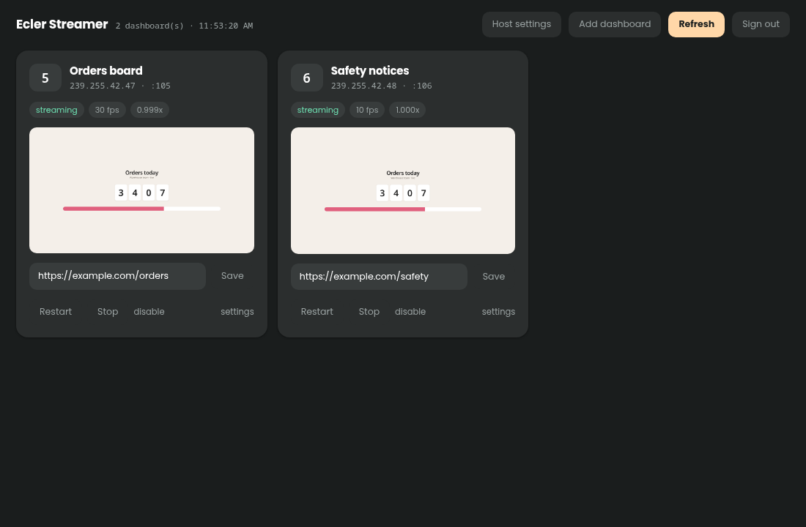

# Ecler Manager & Streamer

Two tools for **Ecler VEO-XTI1C / VEO-XRI1C** H.264 video-over-IP extenders:

- **The manager** — see what every screen is showing, and switch channels
  from a browser instead of a ladder.
- **The streamer** — render a web dashboard headlessly and send it to a
  channel, so no PC needs to be plugged into a transmitter at all.

These extenders ship with no management tool. A receiver that loses its stream —
which happens after a power event — is fixed by climbing to the unit and
pressing its channel button. They are, however, on the network and speak a
control protocol, so none of that is necessary.

**How proven is this?** The manager has run continuously against 30 receivers
since early September 2026 and has done every switch, rename and
commissioning job on that fleet. The streamer is newer: built mid-September,
it currently drives three channels on one machine, has survived reboots
unattended, and has not yet replaced the hardware transmitters in daily
service. Both carry tests that run without any hardware.

Pure Python standard library, **3.8 or newer** — the full test suites are run
against 3.8, 3.9 and 3.14. No `pip install`, no build step, no dependencies. The streamer additionally needs `ffmpeg`, `Xvfb` and `chromium`,
which do the rendering and encoding.

<a href="images/mainscreen.png">
  
</a>

**The manager's main view.** One line per channel, with a dot per TV. A whole
building fits on a screen, and you can still see *which* TV is unwell without
opening anything — amber on Reception is a receiver with no picture, amber on
Workshop is one on the wrong channel, red on Loading Bay is one that stopped
answering. Channel 3 is flagged `no TVs assigned`: a transmitter streaming to
nobody. Receivers deliberately set aside sit in **Spares / In storage**, not
polled and not counted as faults. A channel with a problem opens itself unless
you have collapsed it yourself, as here.

The event log answers the question that actually matters over time — *how often
does this happen?* Every drift, signal loss, switch and re-acquire, timestamped.

<a href="images/detailedview.png">
  
</a>

**A card, and what it can do.** Name, address and MAC, a `signal` chip from the
device's own video-lock state, and how long it took to answer. The channel
buttons switch it — the one it is on now is filled, ★ marks where it should be —
and `Should be` sets the expected channel, which is what turns drift detection
on. Behind `More`: `identify` blinks the screen, `hold dark` parks it until you
release it, `re-acquire` forces it to re-join its stream, `raw` shows the exact
bytes the device last replied with, and `device settings` opens address and name
changes. Every action is read back from the device rather than assumed.

<a href="images/streamer.png">
  
</a>

**The streamer.** One card per dashboard: paste a URL, enable it, and a headless
browser renders it while ffmpeg encodes and multicasts it to that channel. The
thumbnail is a live grab of what the channel is *actually* showing, which is the
one thing a status line cannot tell you. `fps` and `speed` come from the
encoder itself, and a red `dropped` chip appears only when frames are genuinely
being lost.

*(Click any image for the full size. All names and addresses in them are
invented.)*

## What it does

### The manager

- **Shows every receiver's channel and signal state**, grouped by the
  transmitter it is meant to be watching. Distinguishes *wrong channel* from
  *right channel, no picture* — a distinction the front panel cannot make.
- **Switches channels** from the browser, verified by reading the channel back
  off the device afterwards. **Moves a whole group** to another channel in one
  go, and lets you name, add and retire channels without editing the config.
- **`identify`** blinks one TV, and **`hold dark`** parks it until you release
  it, so a receiver can be matched to a physical screen without a ladder.
- **`re-acquire`** forces a receiver to re-join its multicast stream — the
  remote equivalent of unplugging it, and the fix for a screen that is on the
  right channel but blank.
- **Opt-in self-healing** puts a drifted TV back, or re-acquires one that has
  lost its stream, after N consecutive bad polls.
- **Finds devices** the config does not know about, and **commissions** a
  factory-default unit: name, channel, address, reboot, and adopt once it
  answers at its new address.
- **Backup and restore** the whole configuration, and an optional login.

### The streamer

- **Renders any URL** on a virtual display and streams it to a channel as
  H.264 over multicast — replacing a PC wired to a transmitter.
- **A live thumbnail per channel**, taken through the same pipeline the stream
  uses, so you can see what is on a screen without walking to it.
- **Health from the encoder itself** — frames per second, pace, and dropped
  frames — because with several channels running the question stops being
  *is it up* and becomes *which one is falling behind*.
- **systemd owns the streams**; the web UI only starts, stops and restarts
  them. It can crash or be upgraded without interrupting a frame, and a
  stream comes back by itself after a reboot.

See [streamer/README.md](streamer/README.md) to run it.

## Quick start

### 1. Prove the protocol against one of your units (30 seconds)

Read-only; it changes nothing.

```bash
python3 tools/probe.py <a-receiver-ip>
```

Near the bottom you want:

```
parsed channel    : 1
parsed video lock : True
```

If it says `COULD NOT PARSE` but the raw `get_group_id` block above shows a
sensible number, the reply is phrased in a way the parser does not recognise
yet — the raw bytes are printed, and `parse_int` in `eclermanager/veo.py` is
easy to extend. If port 9999 times out, see
[docs/troubleshooting.md](docs/troubleshooting.md).

### 2. Find out what is on the network

```bash
cp devices.example.txt devices.txt      # your inventory: "<ip> <name>" lines
python3 tools/scan.py 10.0.1.1-254 10.0.2.1-254 \
    --names devices.txt \
    --transmitter 10.0.1.1 --transmitter 10.0.1.2 \
    --write-config config.json
```

One TCP connection per address to port 9999, read-only `get_*` commands. It
writes a starting config, so there is no hand-typing of thirty entries.

A receiver with no PoE will not answer and simply will not appear — which is how
you tell in-service units from spares without opening a cupboard. What it
*cannot* see is whether a TV is attached or switched on.

**Keep ranges to subnets that might hold devices.** Sweeping tens of thousands
of empty addresses is an ARP flood, and has been measured knocking a whole fleet
off its streams for ~35 seconds. Sweeps over 8192 addresses are refused unless
forced.

### 3. Check the generated config

```bash
$EDITOR config.json
```

Name the channels and check `expected_group_id` on each TV: the scan adopts
whatever each receiver *happened* to be showing, so any pre-existing drift
became its expectation.

### 4. Run it

```bash
python3 run.py            # → http://127.0.0.1:8477/
```

`--host 0.0.0.0` to let colleagues reach it — but read the warning it prints,
and see [Login](docs/deployment.md#login).

### Or run it in Docker

```bash
docker compose up -d        # then http://<this host>:8477/
```

Both ways are supported and neither is the "real" one — see
[docs/docker.md](docs/docker.md) for volumes, credentials, and why the compose
file uses host networking (short version: discovery has to see the receivers'
VLAN, and a NAT'd bridge cannot).

The streamer is deliberately **not** containerised; its lifecycle model is
systemd and it needs a real interface to send multicast from.

### Try it without hardware

```bash
python3 tools/mock_veo.py --fleet 4 --chaos 20
python3 run.py --config your-mock-config.json
```

The emulator reproduces the real wire format, including the awkward parts, and
`--chaos` makes devices drift and lose their streams the way real ones do.

## Documentation

| | |
|---|---|
| [docs/protocol.md](docs/protocol.md) | How these devices behave on the wire. Read before touching `veo.py` — several findings are counter-intuitive |
| [docs/deployment.md](docs/deployment.md) | Where to run it, container setup, systemd, login, updating from git |
| [docs/usage.md](docs/usage.md) | Every control, plus naming, commissioning, self-healing, backups |
| [docs/troubleshooting.md](docs/troubleshooting.md) | What went wrong on a real fleet and how each was diagnosed — including what did *not* work |
| [docs/api.md](docs/api.md) | HTTP API |
| [docs/docker.md](docs/docker.md) | Running the manager as a container, and why the streamer is not one |
| [streamer/README.md](streamer/README.md) | The streamer: rendering dashboards headlessly and streaming them to receivers, so no PC is attached to a transmitter |
| [streamer/docs/streaming.md](streamer/docs/streaming.md) | How the streaming was proven, and the five failure modes a test pattern hides |

## The protocol, in brief

The full account is in [docs/protocol.md](docs/protocol.md). The essentials:

- **`set_group_id <0-63>` over TCP 9999** selects a receiver's channel; the
  "channel" on the front panel is Ecler's Group ID. Documented in the manual.
- **`get_group_id` and `get_video_lock`** report the current channel and whether
  the stream has locked. Not in Ecler's documentation, but present on the
  firmware and what makes a dashboard possible.
- **Replies are framed by the prompt the device sends after each answer**, not by
  a pause in the bytes. Framing on timing pairs each reply with the wrong
  command — silently, and the values look plausible.
- **Some units reject the documented CRLF** and answer LF only, closing the
  connection otherwise. The line ending is learned per host.
- **`set_static_ip` stores an address that applies at reboot**, while
  `get_ip_config` reports the running one — so the only verification is that the
  device answers at the new address afterwards.
- **A unit serves one control session at a time.** Connecting, closing and
  immediately reconnecting leaves it accepting TCP while answering nothing.

## Layout

Two products in one repository, deployed independently: the manager installs
from the root, the streamer from `streamer/`. A pull on either machine brings
both down and only one gets installed.

```
run.py                        manager entry point
eclermanager/veo.py           the control protocol and its quirks
eclermanager/config.py        config load / validate / save
eclermanager/discovery.py     network sweep, and "is this really a VEO?"
eclermanager/poller.py        polling, drift detection, self-healing, actions
eclermanager/server.py        JSON API, static files, login gate
eclermanager/auth.py          password hashing and signed session cookies
eclermanager/static/          the dashboard and login page
deploy/                       systemd units, install and update scripts
tools/                        see docs/usage.md and docs/troubleshooting.md
tests/

streamer/run.py               streamer web service
streamer/stream.py            what systemd runs, one instance per channel
streamer/eclerstreamer/       config, systemd control, API, UI
streamer/tools/teststream.py  builds and runs the ffmpeg pipeline
streamer/tools/pagesource.sh  puts a page on a virtual display
streamer/deploy/              units, sudo rule, installer
streamer/tests/
```

## Tests

```bash
python3 -m unittest discover -s tests            # manager
node tests/smoke_dashboard.js                    # its dashboard's JS

python3 -m unittest discover -s streamer/tests   # streamer
node streamer/tests/smoke_ui.js                  # its page's JS
```

No hardware needed. The manager's cover the protocol quirks above against
emulated devices that reproduce them — including a unit that rejects CRLF, one
that is slow to answer, and one whose replies would shift by a command under
timing-based framing.

The streamer's pin the settings that were expensive to find — constant-rate
output, the quality floor, no B-frames, the pacing rules — and the systemd
directives that broke it quietly: a sandbox that made its config read-only, one
that stopped it reaching systemd at all, and a restart policy that looped on a
misconfiguration for ever.

Both JavaScript smoke tests run the real page against a stubbed DOM and fire
every button, because `node --check` proves only that a file parses, not that a
handler exists.

To check a Python version rather than assume it:

```bash
python3 tools/check_python.py          # whichever interpreter you have
```

It compiles every file, imports every module — the tools included, which the
suites never touch — runs both suites and checks each CLI answers `--help`.
The header of that file shows how to run it across versions in containers
without installing any of them. Both incompatibilities it found were invisible
by reading: `socket.timeout` only became an alias of `TimeoutError` in 3.10, so
a slow device read as *offline* on 3.8 and 3.9; and `Path.is_relative_to`
arrived in 3.9.

## Contributing

See [CONTRIBUTING.md](CONTRIBUTING.md). The short version: I can only test
against VEO-XRI1C / VEO-XTI1C on firmware `V1.01.r0`, so if your unit parses
differently, `python3 tools/probe.py <ip>` and the raw output in an issue is
worth more than a description.

## Licence

MIT. See [LICENSE](LICENSE).
