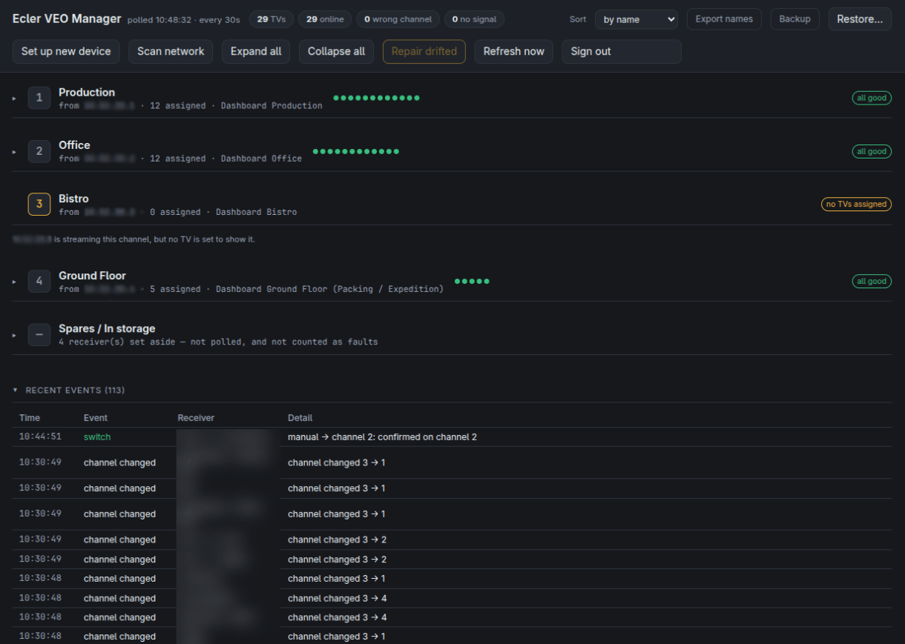
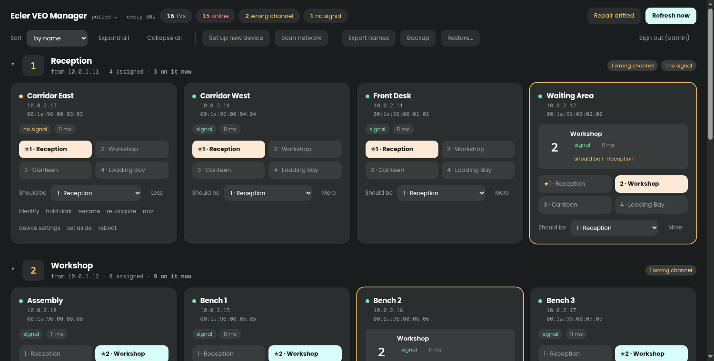

# Ecler VEO Manager

A web dashboard for **Ecler VEO-XTI1C / VEO-XRI1C** H.264 video-over-IP
extenders: see what every screen is showing, and switch channels remotely.

These extenders ship with no management tool. A receiver that loses its stream —
which happens after a power event — is fixed by climbing to the unit and
pressing its channel button. They are, however, on the network and speak a
control protocol, so none of that is necessary.

Pure Python 3.11+ standard library. No `pip install`, no build step, no
dependencies.

<a href="images/mainscreen.png">
  
</a>

**The main view.** One row per transmitter, collapsed. Each row carries a dot
per TV — green, amber, red — so a healthy channel stays a single line you can
still read at a glance. Anything with a problem opens itself: here channel 3 is
flagged `no TVs assigned`, because a transmitter is streaming to nobody. Below
that, receivers deliberately set aside sit in **Spares / In storage**, not
polled and not counted as faults. The event log at the bottom is what answers
"how often does this actually happen?" — every drift, signal loss, switch and
re-acquire, timestamped.

<a href="images/detailedview.png">
  
</a>

**A group expanded.** One card per TV: its name, address and MAC, a `signal`
chip from the device's own video-lock state, and how long it took to answer.
The channel buttons switch it, ★ marks where it should be, and the current
channel is highlighted. `Should be` sets the expected channel and is what turns
drift detection on. Underneath: `identify` blinks the screen, `hold dark` parks
it until you release it, `re-acquire` forces it to re-join its stream, `raw`
shows the exact bytes the device last replied with, and `device settings` opens
address and name changes. One card shows a completed action —
*"identify re-acquire: re-acquired channel 1, signal is back"* — because every
action is read back from the device rather than assumed.

*(Click either image for the full-size version. Receiver names and addresses are
blurred.)*

## What it does

- **Shows every receiver's channel and signal state**, grouped by the
  transmitter it is meant to be watching. Distinguishes *wrong channel* from
  *right channel, no picture* — a distinction the front panel cannot make.
- **Switches channels** from the browser, verified by reading the channel back
  off the device afterwards.
- **`identify`** blinks one TV, and **`hold dark`** parks it until you release
  it, so a receiver can be matched to a physical screen without a ladder.
- **`re-acquire`** forces a receiver to re-join its multicast stream — the
  remote equivalent of unplugging it, and the fix for a screen that is on the
  right channel but blank.
- **Opt-in self-healing** puts a drifted TV back, or re-acquires one that has
  lost its stream, after N consecutive bad polls.
- **Finds devices** the config does not know about, and **commissions** a
  factory-default unit: name, channel, address, reboot, and adopt once it
  answers at its new address.
- **Backup and restore** the whole configuration, and an optional login.

## Quick start

### 1. Prove the protocol against one of your units (30 seconds)

Read-only; it changes nothing.

```bash
python3 tools/probe.py <a-receiver-ip>
```

Near the bottom you want:

```
parsed channel    : 1
parsed video lock : True
```

If it says `COULD NOT PARSE` but the raw `get_group_id` block above shows a
sensible number, the reply is phrased in a way the parser does not recognise
yet — the raw bytes are printed, and `parse_int` in `eclermanager/veo.py` is
easy to extend. If port 9999 times out, see
[docs/troubleshooting.md](docs/troubleshooting.md).

### 2. Find out what is on the network

```bash
cp devices.example.txt devices.txt      # your inventory: "<ip> <name>" lines
python3 tools/scan.py 10.0.1.1-254 10.0.2.1-254 \
    --names devices.txt \
    --transmitter 10.0.1.1 --transmitter 10.0.1.2 \
    --write-config config.json
```

One TCP connection per address to port 9999, read-only `get_*` commands. It
writes a starting config, so there is no hand-typing of thirty entries.

A receiver with no PoE will not answer and simply will not appear — which is how
you tell in-service units from spares without opening a cupboard. What it
*cannot* see is whether a TV is attached or switched on.

**Keep ranges to subnets that might hold devices.** Sweeping tens of thousands
of empty addresses is an ARP flood, and has been measured knocking a whole fleet
off its streams for ~35 seconds. Sweeps over 8192 addresses are refused unless
forced.

### 3. Check the generated config

```bash
$EDITOR config.json
```

Name the channels and check `expected_group_id` on each TV: the scan adopts
whatever each receiver *happened* to be showing, so any pre-existing drift
became its expectation.

### 4. Run it

```bash
python3 run.py            # → http://127.0.0.1:8477/
```

`--host 0.0.0.0` to let colleagues reach it — but read the warning it prints,
and see [Login](docs/deployment.md#login).

### Try it without hardware

```bash
python3 tools/mock_veo.py --fleet 4 --chaos 20
python3 run.py --config your-mock-config.json
```

The emulator reproduces the real wire format, including the awkward parts, and
`--chaos` makes devices drift and lose their streams the way real ones do.

## Documentation

| | |
|---|---|
| [docs/protocol.md](docs/protocol.md) | How these devices behave on the wire. Read before touching `veo.py` — several findings are counter-intuitive |
| [docs/deployment.md](docs/deployment.md) | Where to run it, container setup, systemd, login, updating from git |
| [docs/usage.md](docs/usage.md) | Every control, plus naming, commissioning, self-healing, backups |
| [docs/troubleshooting.md](docs/troubleshooting.md) | What went wrong on a real fleet and how each was diagnosed — including what did *not* work |
| [docs/api.md](docs/api.md) | HTTP API |
| [streamer/README.md](streamer/README.md) | The streamer: rendering dashboards headlessly and streaming them to receivers, so no PC is attached to a transmitter |
| [streamer/docs/streaming.md](streamer/docs/streaming.md) | How the streaming was proven, and the five failure modes a test pattern hides |

## The protocol, in brief

The full account is in [docs/protocol.md](docs/protocol.md). The essentials:

- **`set_group_id <0-63>` over TCP 9999** selects a receiver's channel; the
  "channel" on the front panel is Ecler's Group ID. Documented in the manual.
- **`get_group_id` and `get_video_lock`** report the current channel and whether
  the stream has locked. Not in Ecler's documentation, but present on the
  firmware and what makes a dashboard possible.
- **Replies are framed by the prompt the device sends after each answer**, not by
  a pause in the bytes. Framing on timing pairs each reply with the wrong
  command — silently, and the values look plausible.
- **Some units reject the documented CRLF** and answer LF only, closing the
  connection otherwise. The line ending is learned per host.
- **`set_static_ip` stores an address that applies at reboot**, while
  `get_ip_config` reports the running one — so the only verification is that the
  device answers at the new address afterwards.
- **A unit serves one control session at a time.** Connecting, closing and
  immediately reconnecting leaves it accepting TCP while answering nothing.

## Layout

```
run.py                      entry point
config.example.json         copy to config.json
devices.example.txt         copy to devices.txt: your "<ip> <name>" inventory
eclermanager/veo.py         the control protocol and its quirks
eclermanager/config.py      config load / validate / save
eclermanager/discovery.py   network sweep, and "is this really a VEO?"
eclermanager/poller.py      polling, drift detection, self-healing, actions
eclermanager/server.py      JSON API, static files, login gate
eclermanager/auth.py        password hashing and signed session cookies
eclermanager/static/        the dashboard and login page
deploy/                     systemd units, install and update scripts
tools/                      see docs/usage.md and docs/troubleshooting.md
tests/smoke_dashboard.js    runs the dashboard's JS against a stubbed DOM
tests/test_veo.py           188 tests, no hardware needed
```

## Tests

```bash
python3 -m unittest discover -s tests
```

They cover the protocol quirks above against emulated devices that reproduce
them — including a unit that rejects CRLF, one that is slow to answer, and one
whose replies would shift by a command under timing-based framing.

## Licence

MIT. See [LICENSE](LICENSE).
